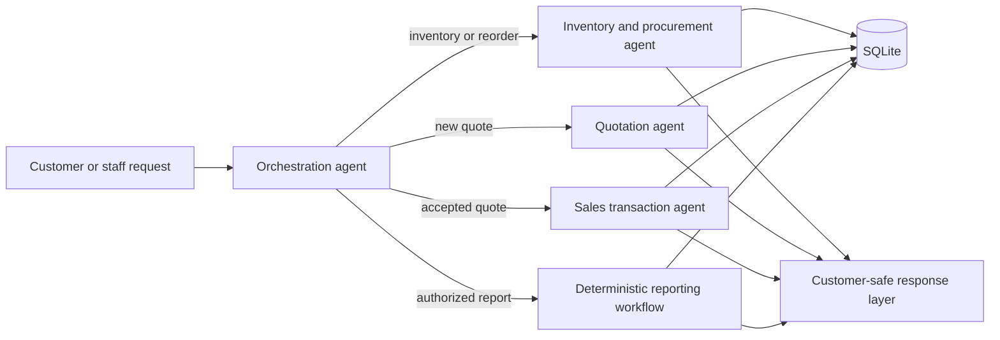

# The Beaver's Choice Paper Company AI Agent

A PydanticAI multi-agent system for inventory management, customer quotations, controlled purchasing, and atomic sales fulfillment at a fictional paper company.

The project separates language-model interpretation from deterministic business logic. Agents classify requests and extract structured information, while Python and SQLite enforce pricing, stock, authorization, idempotency, and transaction rules.

## Key features

- Four specialized agents coordinated through a central request router
- Typed Pydantic inputs and outputs
- Inventory checks and reorder recommendations
- Catalog-based quotation generation with deterministic bulk discounts
- Historical quote search for internal context
- Explicit authorization for purchases, stock receipts, fulfillment, and financial reports
- Atomic SQLite sales transactions with final stock validation and rollback
- Customer-safe responses with pricing and availability explanations
- Reproducible evaluation output covering all 20 supplied requests
- Automated tests for database helpers, tools, routing, privacy, and rubric requirements

## Architecture



| Agent | Responsibility |
| --- | --- |
| Orchestration agent | Classifies the request and selects one controlled workflow; it cannot authorize writes |
| Inventory and procurement agent | Checks stock, estimates supplier dates, recommends reorders, and exposes authorization-gated inventory operations |
| Quotation agent | Extracts exact catalog products, quantities, and units from customer text |
| Sales transaction agent | Verifies explicit quote acceptance before the deterministic fulfillment workflow runs |

The complete diagrams, tool mappings, and data flows are documented in [Diagram and Planning](project/diagram%20and%20planning.md).

## Required starter helpers

All required starter helpers are used through registered agent tools:

| Helper | Registered tool |
| --- | --- |
| `create_transaction()` | `record_stock_receipt` |
| `get_all_inventory()` | `inventory_overview` |
| `get_stock_level()` | `inventory_lookup` |
| `get_supplier_delivery_date()` | `supplier_delivery_date` |
| `get_cash_balance()` | `cash_balance` |
| `generate_financial_report()` | `financial_report` |
| `search_quote_history()` | `search_historical_quotes` |

## Technology

- Python 3.11+
- Pydantic and PydanticAI
- SQLAlchemy and SQLite
- pandas and NumPy
- uv for dependency and environment management
- pytest for automated testing

## Repository structure

```text
.
├── README.md
├── project/
│   ├── project_starter.py
│   ├── customer_responses.py
│   ├── pyproject.toml
│   ├── uv.lock
│   ├── quote_requests.csv
│   ├── quote_requests_sample.csv
│   ├── quotes.csv
│   ├── test_results.csv
│   ├── diagram and planning.md
│   ├── evaluation and reflection.md
│   └── industry best practices.md
└── Test-Project/
    └── test_starter_project.py
```

Local secrets, virtual environments, caches, editor settings, and runtime databases are excluded by `.gitignore`.

## Setup with uv

Install [uv](https://docs.astral.sh/uv/) and clone the repository:

```bash
git clone https://github.com/AhmedSAAhmed/The-Beaver-s-Choice-Paper-Company-AI-Agent.git
cd The-Beaver-s-Choice-Paper-Company-AI-Agent
uv sync --project project
```

The project pins Python compatibility to 3.11 or newer. You do not need the newest Python release.

## Environment configuration

Create a `.env` file in the repository root:

```dotenv
UDACITY_OPENAI_API_KEY=your_api_key_here
OPENAI_BASE_URL=your_openai_compatible_base_url
MODEL_NAME=your_model_name
```

The `.env` file is ignored by Git. Never commit real credentials.

## Run the system

```bash
uv --project project run python project/project_starter.py
```

This initializes a clean evaluation database, processes the supplied sample requests, and writes the results to `project/test_results.csv`.

The final submitted CSV uses the documented offline replay mode to avoid retransmitting the complete dataset to an external endpoint. See [Evaluation and Reflection](project/evaluation%20and%20reflection.md) for the methodology and limitations.

## Run the tests

```bash
uv --project project run python -m pytest Test-Project/test_starter_project.py -q
```

Current verification result: **41 tests passed**.

## Evaluation results

The submitted evaluation covers the complete `quote_requests_sample.csv` dataset:

| Metric | Result |
| --- | ---: |
| Requests evaluated | 20 of 20 |
| Successfully fulfilled | 3 |
| Requests changing cash balance | 3 |
| Unfulfilled with documented reasons | 17 |
| Total cash increase from confirmed sales | $216.03 |

Requests are intentionally left unfulfilled when stock is insufficient, catalog information is ambiguous, units require clarification, or authorization is missing.

## Safety and explainability

- Agent output cannot independently authorize a purchase or sale.
- Pending supplier orders are not counted as available inventory.
- Final fulfillment rechecks quote validity, totals, expiration, and stock inside one SQLite transaction.
- Duplicate request IDs and quote IDs provide idempotency protection.
- Customer responses include discount and availability rationales.
- Historical customer requests, internal quote explanations, SQL errors, stack traces, margins, and unauthorized financial information are excluded from customer-facing output.

See [Industry Best Practices](project/industry%20best%20practices.md) for the full transparency and information-protection design.

## Documentation

- [System diagrams and tool plan](project/diagram%20and%20planning.md)
- [Evaluation and reflection](project/evaluation%20and%20reflection.md)
- [Industry best practices](project/industry%20best%20practices.md)
- [Evaluation results](project/test_results.csv)
- [Automated tests](Test-Project/test_starter_project.py)

## Project status

This repository is an educational multi-agent systems project. The company, customers, inventory, and transactions are fictional and intended for demonstration and evaluation.
