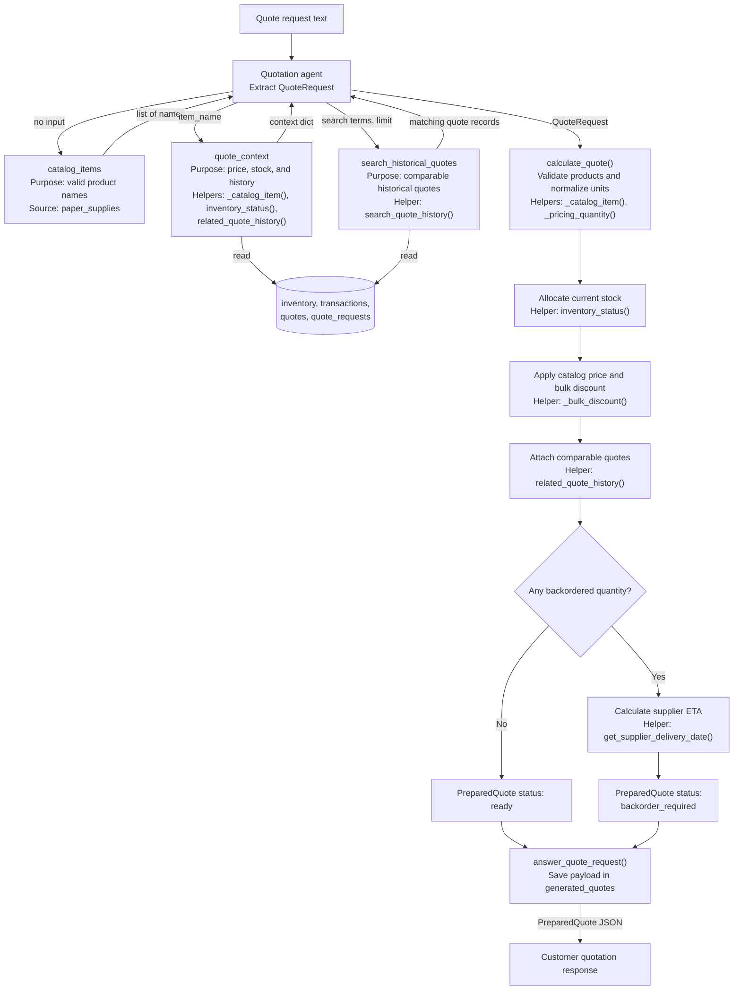
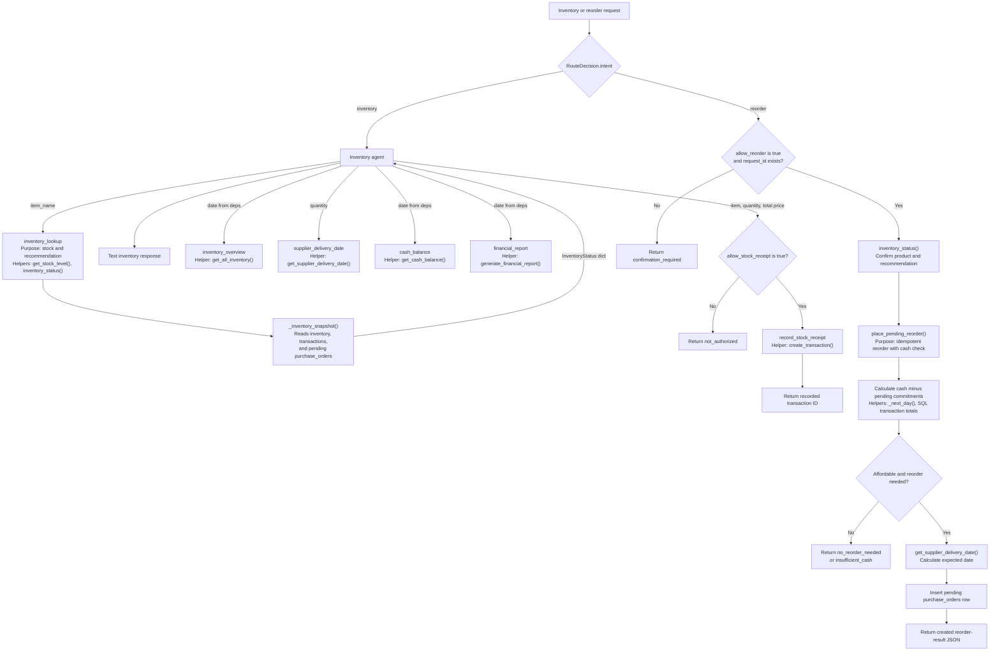
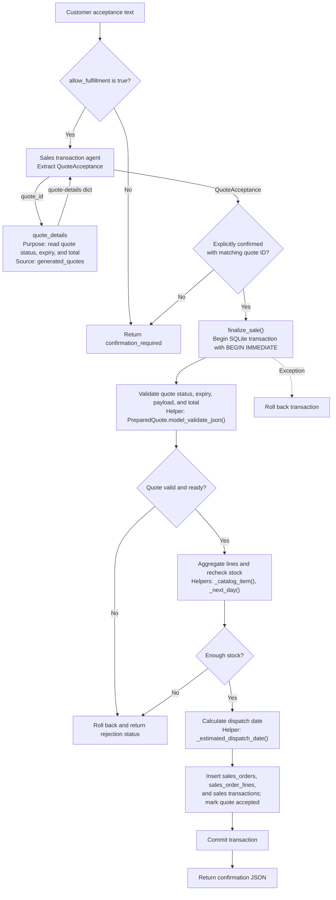
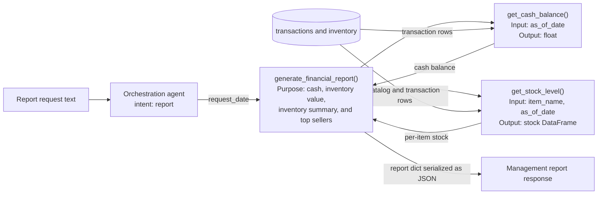

# Diagram and Planning

This implementation uses four agents: one orchestration agent and three specialist agents. The agents interpret text and return typed outputs. Every calculation and database mutation is performed by a deterministic helper behind a registered tool or controlled workflow. Write-capable tools also require caller-supplied authorization, so an LLM cannot independently authorize a transaction.

## 1. System architecture and orchestration

The main diagram identifies every agent, its non-overlapping responsibility, its registered tools, the exact helper functions behind each tool, and the data exchanged between layers.

```mermaid
flowchart TB
    USER["Customer text request"] --> INPUT["Input<br/>message, request_date, request_id<br/>authorization flags"]

    subgraph ORCHESTRATION["Agent 1: Orchestration"]
        ORCH["Orchestration agent<br/>Responsibility: classify intent and extract<br/>item_name or quote_id"]
        DECISION["RouteDecision<br/>inventory | reorder | quote<br/>accept_quote | report | clarify"]
        CONTROL["handle_customer_request()<br/>Validates authorization and dispatches<br/>one controlled workflow"]
        ORCH -->|"structured output"| DECISION
        DECISION --> CONTROL
    end

    INPUT --> ORCH

    subgraph INVENTORY["Agent 2: Inventory and Procurement"]
        INV_AGENT["Inventory agent<br/>Responsibility: stock operations,<br/>supplier estimates, and management reads"]
        INV_LOOKUP["Tool: inventory_lookup<br/>Purpose: stock and reorder recommendation<br/>Input: item_name | Output: InventoryStatus dict<br/>Helpers: get_stock_level(), inventory_status(),<br/>_inventory_snapshot(), _next_day()"]
        INV_ALL["Tool: inventory_overview<br/>Purpose: all positive stock balances<br/>Input: date from deps | Output: item/quantity map<br/>Helper: get_all_inventory()"]
        INV_ETA["Tool: supplier_delivery_date<br/>Purpose: supplier ETA estimate<br/>Input: quantity | Output: ISO date<br/>Helper: get_supplier_delivery_date()"]
        INV_CASH["Tool: cash_balance<br/>Purpose: current cash position<br/>Input: date from deps | Output: float<br/>Helper: get_cash_balance()"]
        INV_REPORT["Tool: financial_report<br/>Purpose: management report<br/>Input: date from deps | Output: report dict<br/>Helper: generate_financial_report()"]
        INV_REORDER["Tool: request_reorder<br/>Purpose: authorized pending purchase order<br/>Input: item_name | Output: reorder-result dict<br/>Helpers: place_pending_reorder(), _inventory_snapshot(),<br/>_next_day(), get_supplier_delivery_date()"]
        INV_RECEIPT["Tool: record_stock_receipt<br/>Purpose: authorized received-stock transaction<br/>Input: item, quantity, total_price | Output: receipt dict<br/>Helper: create_transaction()"]
        INV_AGENT -->|"tool call"| INV_LOOKUP
        INV_AGENT -->|"tool call"| INV_ALL
        INV_AGENT -->|"tool call"| INV_ETA
        INV_AGENT -->|"tool call"| INV_CASH
        INV_AGENT -->|"tool call"| INV_REPORT
        INV_AGENT -->|"authorized tool call"| INV_REORDER
        INV_AGENT -->|"authorized tool call"| INV_RECEIPT
        INV_LOOKUP -->|"tool result"| INV_AGENT
        INV_ALL -->|"tool result"| INV_AGENT
        INV_ETA -->|"tool result"| INV_AGENT
        INV_CASH -->|"tool result"| INV_AGENT
        INV_REPORT -->|"tool result"| INV_AGENT
        INV_REORDER -->|"tool result"| INV_AGENT
        INV_RECEIPT -->|"tool result"| INV_AGENT
    end

    subgraph QUOTATION["Agent 3: Quotation"]
        QUOTE_AGENT["Quotation agent<br/>Responsibility: extract exact products,<br/>quantities, and units"]
        CATALOG["Tool: catalog_items<br/>Purpose: list valid product names<br/>Input: none | Output: list of names<br/>Source: paper_supplies"]
        CONTEXT["Tool: quote_context<br/>Purpose: stock, price, and comparable quotes<br/>Input: item_name | Output: context dict<br/>Helpers: _catalog_item(), inventory_status(),<br/>related_quote_history()"]
        HISTORY_SEARCH["Tool: search_historical_quotes<br/>Purpose: find comparable historical quotes<br/>Input: terms and limit | Output: quote records<br/>Helper: search_quote_history()"]
        QUOTE_AGENT -->|"tool call"| CATALOG
        QUOTE_AGENT -->|"tool call"| CONTEXT
        QUOTE_AGENT -->|"tool call"| HISTORY_SEARCH
        CATALOG -->|"product names"| QUOTE_AGENT
        CONTEXT -->|"stock and history"| QUOTE_AGENT
        HISTORY_SEARCH -->|"matching quote records"| QUOTE_AGENT
    end

    subgraph SALES["Agent 4: Sales Transaction"]
        SALES_AGENT["Sales transaction agent<br/>Responsibility: verify explicit acceptance<br/>and extract the accepted quote ID"]
        DETAILS["Tool: quote_details<br/>Purpose: read stored quote status, expiry, and total<br/>Input: quote_id | Output: quote-details dict<br/>Source: generated_quotes"]
        SALES_AGENT -->|"tool call"| DETAILS
        DETAILS -->|"stored quote details"| SALES_AGENT
    end

    REORDER_FLOW["Deterministic reorder workflow<br/>inventory_status() then place_pending_reorder()<br/>Output: reorder-result JSON"]
    QUOTE_FLOW["Deterministic quote workflow<br/>answer_quote_request() then calculate_quote()<br/>Output: PreparedQuote JSON"]
    SALES_FLOW["Atomic sales workflow<br/>finalize_sale()<br/>Output: confirmation JSON"]
    REPORT["Reporting tool<br/>generate_financial_report()<br/>Helpers: get_cash_balance(), get_stock_level()<br/>Output: report JSON"]

    DB[("SQLite<br/>transactions, inventory, quote_requests, quotes,<br/>purchase_orders, generated_quotes,<br/>sales_orders, sales_order_lines")]
    RESPONSE["Customer response boundary<br/>customer_responses.py<br/>Adds rationale and removes internal context"]

    CONTROL -->|"inventory"| INV_AGENT
    CONTROL -->|"reorder plus authorization"| REORDER_FLOW
    CONTROL -->|"quote"| QUOTE_AGENT
    CONTROL -->|"accept_quote plus authorization"| SALES_AGENT
    CONTROL -->|"report"| REPORT
    CONTROL -->|"clarify"| RESPONSE

    INV_LOOKUP -->|"read"| DB
    INV_ALL -->|"read"| DB
    INV_CASH -->|"read"| DB
    INV_REPORT -->|"read"| DB
    INV_REORDER -->|"read and write"| DB
    INV_RECEIPT -->|"write when authorized"| DB
    REORDER_FLOW -->|"read and write"| DB
    CONTEXT -->|"read"| DB
    HISTORY_SEARCH -->|"read"| DB
    QUOTE_AGENT -->|"QuoteRequest"| QUOTE_FLOW
    QUOTE_FLOW -->|"read and write"| DB
    SALES_AGENT -->|"QuoteAcceptance"| SALES_FLOW
    DETAILS -->|"read"| DB
    SALES_FLOW -->|"atomic read and write"| DB
    REPORT -->|"read"| DB

    INV_AGENT -->|"inventory response"| RESPONSE
    REORDER_FLOW --> RESPONSE
    QUOTE_FLOW --> RESPONSE
    SALES_FLOW --> RESPONSE
    REPORT --> RESPONSE
    RESPONSE --> USER
```

The primary reorder route is intentionally deterministic: after the orchestration agent classifies an explicit reorder request, `handle_customer_request()` validates `allow_reorder` and `request_id`, then calls `inventory_status()` and `place_pending_reorder()`. The inventory agent also exposes gated `request_reorder` and `record_stock_receipt` tools, but neither can write unless the calling workflow supplies the corresponding authorization flag.

## 2. Customer inquiry and quotation workflow

The quotation agent only identifies products, quantities, and units. All arithmetic and database writes occur afterward in deterministic functions.

## 3. Inventory management and reordering workflow

Inventory reads and purchase-order writes use separate controlled paths. A stable `request_id` prevents duplicate purchase orders, and pending orders are excluded from available stock.

The registered `request_reorder` inventory-agent tool wraps the same `place_pending_reorder()` helper and applies the same `allow_reorder` and `request_id` authorization gate. `record_stock_receipt` is a separate, explicitly gated path for received supplier inventory; it uses `create_transaction()` only for `stock_orders`, never for customer sales.

## 4. Sequential sales and order-fulfillment workflow

The sales agent verifies language-level acceptance. The deterministic `finalize_sale()` function then performs quote validation, the final stock check, and every database mutation inside one SQLite write transaction.

## 5. Global financial and inventory reporting

Reporting is a deterministic helper invoked directly by the orchestration controller, so it does not increase the agent count. The same helper is also exposed through the inventory agent's read-only `financial_report` tool to satisfy agent-tool access requirements without duplicating reporting logic.

## Agent count

| Number | Agent | Exclusive responsibility | Typed output |
| --- | --- | --- | --- |
| 1 | Orchestration agent | Classifies one request, extracts routing fields, and selects an allowed workflow; it does not calculate prices or write to the database | `RouteDecision` |
| 2 | Inventory and procurement agent | Handles stock reads, supplier estimates, management-data reads, gated replenishment, and authorized stock receipts | Text assembled from tool-result dictionaries |
| 3 | Quotation agent | Extracts exact products, quantities, and units; it does not perform arithmetic or inventory writes | `QuoteRequest` |
| 4 | Sales transaction agent | Verifies explicit acceptance and extracts a stored quote ID; it does not directly mutate inventory | `QuoteAcceptance` |

Total agents: **4**, which is below the project maximum of five.

## Tool plan

| Owner | Tool or workflow | Type | Purpose | Input | Output | Exact helper functions or source |
| --- | --- | --- | --- | --- | --- | --- |
| Inventory agent | `inventory_lookup` | Registered agent tool | Return available stock, minimum stock, pending orders, and a reorder recommendation | `item_name` plus `InventoryDeps` | `InventoryStatus` dictionary | `get_stock_level()`, `inventory_status()`, `_inventory_snapshot()`, `_next_day()` |
| Inventory agent | `inventory_overview` | Registered agent tool | Return all products with positive stock as of the request date | `InventoryDeps` | `dict[str, int]` | `get_all_inventory()` |
| Inventory agent | `supplier_delivery_date` | Registered agent tool | Estimate when a positive supplier quantity can arrive | `quantity` plus `InventoryDeps` | ISO date string | `get_supplier_delivery_date()` |
| Inventory agent | `cash_balance` | Registered agent tool | Return the cash position as of the request date | `InventoryDeps` | `float` | `get_cash_balance()` |
| Inventory agent | `financial_report` | Registered agent tool | Return cash, inventory value, total assets, inventory detail, and top sellers | `InventoryDeps` | Report dictionary | `generate_financial_report()` |
| Inventory agent | `request_reorder` | Registered agent tool | Create a pending reorder only when the workflow authorizes it | `item_name` plus `allow_reorder` and `request_id` | Reorder-result dictionary | `place_pending_reorder()`, `_inventory_snapshot()`, `_next_day()`, `get_supplier_delivery_date()` |
| Inventory agent | `record_stock_receipt` | Registered agent tool | Record received supplier inventory only when the caller authorizes the write | `item_name`, `quantity`, `total_price`, `allow_stock_receipt` | Receipt-result dictionary | `create_transaction()` |
| Quotation agent | `catalog_items` | Registered agent tool | Return the exact catalog product names that may be quoted | None | `list[str]` | `paper_supplies` |
| Quotation agent | `quote_context` | Registered agent tool | Return product price, stock information, and comparable quote history | `item_name` plus `QuoteDeps` | Context dictionary | `_catalog_item()`, `inventory_status()`, `related_quote_history()` |
| Quotation agent | `search_historical_quotes` | Registered agent tool | Search earlier requests and explanations for comparable quotes | `search_terms`, `limit`, and `QuoteDeps` | Quote-record list | `search_quote_history()` |
| Sales agent | `quote_details` | Registered agent tool | Return stored quote status, expiry, and total without creating an order | `quote_id` plus `OrderingDeps` | Quote-details dictionary | SQL read from `generated_quotes` |
| Orchestration controller | Reorder workflow | Deterministic workflow | Validate authorization and create an idempotent pending purchase order | `item_name`, date, request ID | Reorder-result JSON | `inventory_status()`, `place_pending_reorder()` |
| Quotation workflow | Quote calculator | Deterministic workflow | Validate items, normalize units, allocate stock, apply discounts, attach history, and calculate ETA | `QuoteRequest`, date | `PreparedQuote` | `calculate_quote()`, `_pricing_quantity()`, `_bulk_discount()`, `inventory_status()`, `related_quote_history()`, `get_supplier_delivery_date()` |
| Sales workflow | Atomic fulfillment | Deterministic workflow | Validate a quote, recheck stock, and atomically create the sale | `quote_id`, order date | Confirmation dictionary | `finalize_sale()`, `_catalog_item()`, `_next_day()`, `_estimated_dispatch_date()` |
| Orchestration controller | Global reporting | Deterministic tool | Generate company-wide financial and inventory summaries | `as_of_date` | Report dictionary | `generate_financial_report()`, `get_cash_balance()`, `get_stock_level()` |

## Data and reliability plan

SQLite tables used by the implemented workflows:

- `transactions`
- `inventory`
- `quote_requests`
- `quotes`
- `purchase_orders`
- `generated_quotes`
- `sales_orders`
- `sales_order_lines`

Implemented reliability controls:

- Typed Pydantic outputs are used for routing, quote extraction, inventory status, and quote acceptance.
- The orchestration agent cannot authorize reorder or fulfillment operations; those permissions come from caller-supplied flags.
- `record_stock_receipt` defaults to unauthorized and accepts only positive quantities, non-negative costs, and known catalog items.
- `create_transaction()` is exposed only for authorized supplier receipts; customer sales continue through the atomic `finalize_sale()` workflow.
- Customer quotes exclude historical quote records and prior customer request text; only transaction-relevant fields and plain-language rationales leave the response boundary.
- Cash balances and financial reports require a caller-supplied `allow_financial_report` authorization flag.
- Low-level validation states and exception details are translated into actionable customer-safe explanations by `customer_responses.py`.
- Stable request IDs prevent duplicate purchase orders and duplicate generated quotes.
- Quote IDs are checked against the original customer message before fulfillment.
- Quote arithmetic, bulk discounts, stock allocation, and delivery estimates are deterministic Python operations.
- Pending purchase orders are not counted as available stock.
- Sales fulfillment uses `BEGIN IMMEDIATE`, a final stock check, commit, and rollback handling.
- Duplicate quote lines are aggregated before the final inventory check.
- No external supplier, carrier, forecasting, margin, customer-profile, or audit service is claimed because those capabilities are not implemented in the submitted code.
